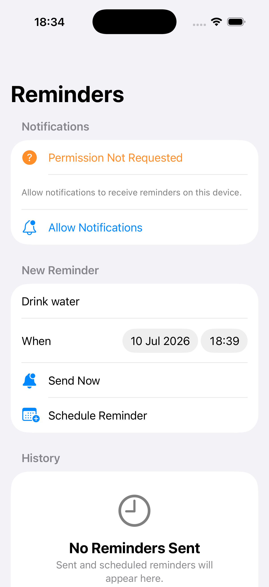

# SwiftUI Push Notifications Showcase


A compact SwiftUI local-notifications app built with `UserNotifications`, dependency injection, `UserDefaults`, and Swift Testing.

This showcase is designed as a focused reference project: the UI stays simple, `UserNotifications` remains isolated from presentation code, and the complete notification flow runs without a backend or private infrastructure.


---

## Table of Contents

- [Requirements](#requirements)
- [Features](#features)
- [Architecture](#architecture)
- [Technical Decisions](#technical-decisions)
- [Setup](#setup)
- [Configuration](#configuration)
- [Tests](#tests)
- [Screenshots](#screenshots)
- [License](#license)

## Requirements

- **iOS 26.0+**
- **Swift 6.0+**
- **Xcode 26.2+**

## Features

### Notification Flow

- Request notification permission and display the current authorization state
- Send a local reminder immediately
- Schedule a local reminder for a future date
- Present notifications while the app is in the foreground
- Open a reminder detail screen after interacting with a notification
- Explain the denied-permission state and prevent notification requests until permission is enabled

### History and Testing

- Persist sent and scheduled reminders locally with `UserDefaults`
- Differentiate immediate and scheduled reminders in the history
- Keep `UserNotifications` behind the `NotificationService` contract
- Dependency injection for production, previews, and tests
- Swift Testing coverage for validation, content creation, history, and the immediate-send flow

## Architecture

```text
PushNotificationsShowcase
├── App
│   ├── NotificationRouter
│   └── PushNotificationsShowcaseApp
├── Presentation
│   ├── ContentView
│   ├── NotificationViewModel
│   └── ReminderDetailView
├── Domain
│   ├── ReminderScheduleInput
│   ├── ReminderNotificationContent
│   └── ReminderHistoryRecord
└── Data
    ├── UserNotificationService
    └── UserDefaultsReminderHistoryStore
```

### Main Flow

```text
Reminder form
-> Send now or schedule
-> NotificationService
-> UserNotifications
-> Local history
-> Reminder detail after notification interaction
```

## Technical Decisions

- `NotificationService` is the only notification dependency visible to the presentation layer.
- `UserNotificationService` is the only type that imports the `UserNotifications` framework.
- `NotificationViewModel` uses `@Observable` and `@MainActor` for predictable SwiftUI state updates.
- The immediate-send action uses a one-second `UNTimeIntervalNotificationTrigger`, the shortest reliable local-notification delay supported by iOS.
- `UserDefaultsReminderHistoryStore` persists a deliberately small local history without adding database infrastructure.
- The router keeps notification interaction separate from the notification UI.
- Remote push, APNs tokens, campaigns, analytics, and user accounts remain out of scope.

## Setup

1. Open `PushNotificationsShowcase.xcodeproj` in Xcode 26.2 or later.
2. Select the `PushNotificationsShowcase` scheme.
3. Run the `PushNotificationsShowcase` target on an iOS simulator or a physical device.

The app works out of the box: local notifications do not require a server, API key, or external configuration.

## Configuration

### Local Notifications

1. Run the app and tap **Allow Notifications** when iOS displays the permission prompt.
2. Use **Send Now** to receive a reminder after a short delay, or select a future date and use **Schedule Reminder**.
3. Tap a received notification to open its reminder detail screen.

The permission prompt appears only once per installation. To test it again, delete the app from the simulator or change its notification permission in **Settings**.

Local notifications work in the simulator. Remote push notifications require APNs signing, an entitlement, and a provider server; they are intentionally not included in this project.

## Tests

From the terminal:

```sh
xcodebuild test \
  -project PushNotificationsShowcase.xcodeproj \
  -scheme PushNotificationsShowcase \
  -destination 'platform=iOS Simulator,name=iPhone 17 Pro,OS=26.2'
```

The tests verify title and date validation, scheduled and immediate notification content, history metadata, and ViewModel behavior when sending a reminder immediately.

## Screenshots



## License

SwiftUI Push Notifications Showcase is available under the MIT License. See [LICENSE](LICENSE) for details.
